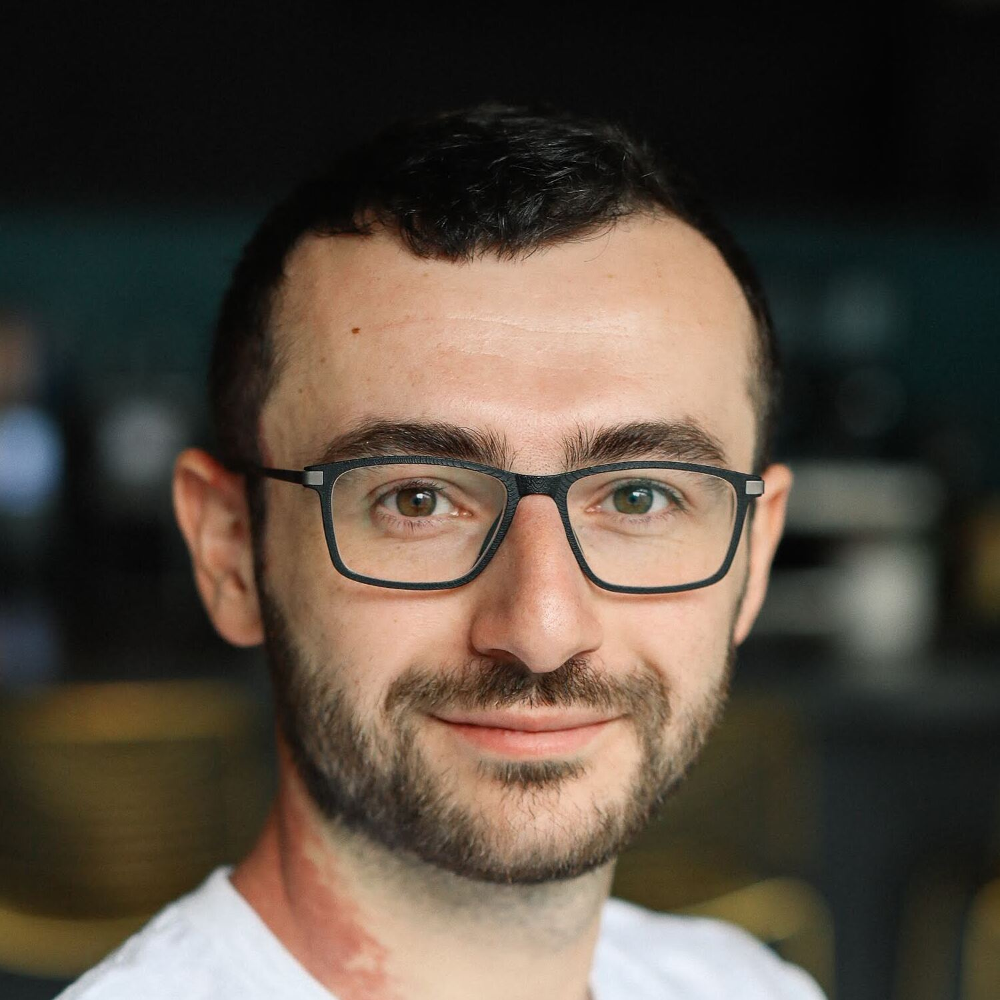

##  About Me

I am currently a CS **Ph.D. student** at [EPFL](https://epfl.ch) advised by prof.[Antoine Bosselut](https://atcbosselut.github.io/) at the [NLP lab](https://nlp.epfl.ch) and by prof.[Lonneke van der Plas](https://sites.google.com/site/lonnekenlp/) at the [Università della Svizzera italiana](https://www.usi.ch/en). I have also been a Research Assistant at Idiap Research Institute during my first year of PhD.

Previously, I completed my MSc. in Data Science at EPFL where I did research on commonsense and causal reasoning. In the past, I have been a software/ML engineer, co-founder/entrepreneur and have 5+ years of experience in areas ranging from semiconductors to AI. I am also a proud University of Waterloo alumnus where I finished my Bachelor's in Computer Science with distinction.

--- 

##  Research Interests

My interests broadly lie within the nature of **robust artificial intelligence, language, creativity and mind**. Currently, my research focuses on understanding, evaluating and improving creativity of AI systems. Additionally, I am investigating core abilities essential for creativity in AI, including reasoning, generalization, compositionality, abstraction, and analogy-making. 

--- 

##  Publications
1. **Evaluating Creative Short Story Generation in Humans and Large Language Models** 
    **Mete Ismayilzada**, Claire Stevenson, Lonneke van der Plas 
    Preprint 
    [[paper](https://arxiv.org/abs/2411.02316)] [[code]](https://github.com/mismayil/creative-story-gen)

1. **Creativity in AI: Progresses and Challenges** 
    **Mete Ismayilzada**, Debjit Paul, Antoine Bosselut, Lonneke van der Plas 
    Preprint 
    [[paper](https://arxiv.org/abs/2410.17218)] [[code]](https://github.com/mismayil/creativity-in-AI) [[media]](https://buildingcreativemachines.substack.com/p/unveiling-the-creativity-potential)

1. **Evaluating Morphological Compositional Generalization in Large Language Models** 
    **Mete Ismayilzada**, Defne Circi\*, Jonne Sälevä\*, Hale Sirin, Abdullatif Köksal, Bhuwan Dhingra, Antoine Bosselut, Lonneke van der Plas, Duygu Ataman 
    Preprint 
    [[paper](https://arxiv.org/abs/2410.12656)]

1. **CRoW: Benchmarking Commonsense Reasoning in Real-World Tasks** 
    **Mete Ismayilzada**, Debjit Paul\*, Syrielle Montariol\*, Mor Geva, Antoine Bosselut 
    EMNLP 2023 (Oral) 
    [[paper](https://aclanthology.org/2023.emnlp-main.607)] [[website](https://mete.is/crow)] 

1. **kogito: A Commonsense Knowledge Inference Toolkit.** 
    **Mete Ismayilzada**, Antoine Bosselut. 
    EACL System Demonstrations Track, 2023 (Poster) 
    [[paper](https://aclanthology.org/2023.eacl-demo.12)] [[code](https://github.com/epfl-nlp/kogito)] [[docs](https://kogito.readthedocs.io)]

1. **DiffuCOMET: Contextual Commonsense Knowledge Diffusion** 
    Silin Gao, **Mete Ismayilzada**, Mengjie Zhao, Hiromi Wakaki, Yuki Mitsufuji, Antoine Bosselut 
    ACL 2024 
    [[paper](https://aclanthology.org/2024.acl-long.264/)]

1. **Exploring Defeasibility in Causal Reasoning** 
    Shaobo Cui, Lazar Milikic, Yiyang Feng, **Mete Ismayilzada**, Debjit Paul, Antoine Bosselut, Boi Faltings 
    ACL 2024 Findings 
    [[paper](https://aclanthology.org/2024.findings-acl.384/)]

1. **REFINER: Reasoning Feedback on Intermediate Representations** 
    Debjit Paul, **Mete Ismayilzada**, Maxime Peyrard, Beatriz Borges, Antoine Bosselut, Robert West, Boi Faltings 
    EACL 2024 
    [[paper](https://aclanthology.org/2024.eacl-long.67/)]

1. **Could ChatGPT get an Engineering Degree? Evaluating Higher Education Vulnerability to AI Assistants** 
    Beatriz Borges, Negar Foroutan, Deniz Bayazit, Syrielle Montariol, Mohammadreza Banaei, [...], **Mete Ismayilzada**, Debjit Paul, Tanja Käser, Antoine Bosselut 
    PNAS 2024 
    [[paper](https://www.pnas.org/doi/10.1073/pnas.2414955121)]

---

##  Education

1. **Ph.D in Computer Science**. EPFL. Lausanne, Switzerland. 2023-Present.
1. **Master's in Data Science**. EPFL. Lausanne, Switzerland. 2021-2023.
1. **Bachelor's in Computer Science**. University of Waterloo. Waterloo, Canada. 2012-2016.

--- 

##  Research Experience

1. **Research Assistant**. Idiap Research Institute. Martigny, Switzerland. 2023-2025.
1. **Research Assistant**. [Artificial Intelligence Lab](https://lia.epfl.ch/). EPFL. Fall 2022.
1. **Research Intern**. Sony Inc. Tokyo, Japan. Summer 2022.

---

##  Teaching Experience

1. **Teaching Assistant**. [Modern NLP](https://nlp.epfl.ch/cs-552-modern-nlp/). EPFL. Spring 2024.
1. **Student Teaching Assistant**. [Modern NLP](https://nlp.epfl.ch/cs-552-modern-nlp/). EPFL. Spring 2023.
1. **Student Teaching Assistant**. [Applied Data Analysis](https://dlab.epfl.ch/teaching/fall2022/cs401/). EPFL. Fall 2022.

---

##  Engineering Experience

1. **Software/ML Engineer**. integrate.ai. Toronto, Canada. 2019-2021.
1. **Co-founder/CTO**. Destin AI. Toronto, Canada. 2017-2019.
1. **Software Engineer**. Bluecat Networks. Toronto, Canada. 2017-2018.
1. **Software Engineer**. Cisco Systems. Ottawa, Canada. 2016-2017.
1. **Software Engineer Intern**. Freescale Semiconductors. Ottawa, Canada. Summer 2015.
1. **Software Developer Intern**. TD Securities. Toronto, Canada. Summer 2014.
1. **Software Developer Intern**. Azercell MMC. Baku, Azerbaijan. Summer 2013.

---

##  Service

1. **Reviewer**. ACL ARR, SEM (Apr 2024), EACL (SRW Jan 2024).
1. **Volunteer**. Perspectives on AI Symposiums. IDIAP. Feb 2024.

---

##  Projects
1. **Parrot**. Educational toolkit for interaction with OpenAI models. [[code]](https://github.com/epfl-nlp/parrot)
1. **kogito**. A Python Commonsense Knowledge Inference Toolkit. [[docs]](https://kogito.readthedocs.io/en/latest/) [[code]](https://github.com/epfl-nlp/kogito)
1. **mini-pytorch**. From scratch implementation of (mini) pytorch autograd and several core modules. [[code](https://github.com/mismayil/mini-pytorch)]
1. **Words and Personalities**. Personality analysis based on quotes. [[demo](https://mismayil.github.io/words-personalities)] [[code](https://github.com/mismayil/words-personalities)]
1. **Differentially Private Random Forest Classifier**. [[code](https://github.com/IBM/differential-privacy-library/releases/tag/0.5.0)]

---

##  Misc
1. Interview for Building Creative Machines. Substack. [[link]](https://buildingcreativemachines.substack.com/p/interview-mete-ismayilzada-unlocking)
1. From Words to Vectors. Towards Data Science. Medium. [[link](https://medium.com/towards-data-science/from-words-to-vectors-e24f0977193e)]

---

##  Hobbies
In my free time, I like to [read](https://www.goodreads.com/user/show/34889251-mete-ismayil), [road bike](https://www.strava.com/athletes/33241990), [play piano and dombra](https://youtube.com/playlist?list=PLWgqALhmmentLA30W40VUV6HXOHH0n6z-) and watch (usually long) [international art films](https://boxd.it/ggyee).

---

##  Contact
1. [mismayilza [at] gmail [dot] com](mailto:)
1. [google scholar](https://scholar.google.com/citations?hl=en&user=l88cHEQAAAAJ)
1. [github](https://github.com/mismayil)
1. [linkedin](https://www.linkedin.com/in/mismayilzada)
