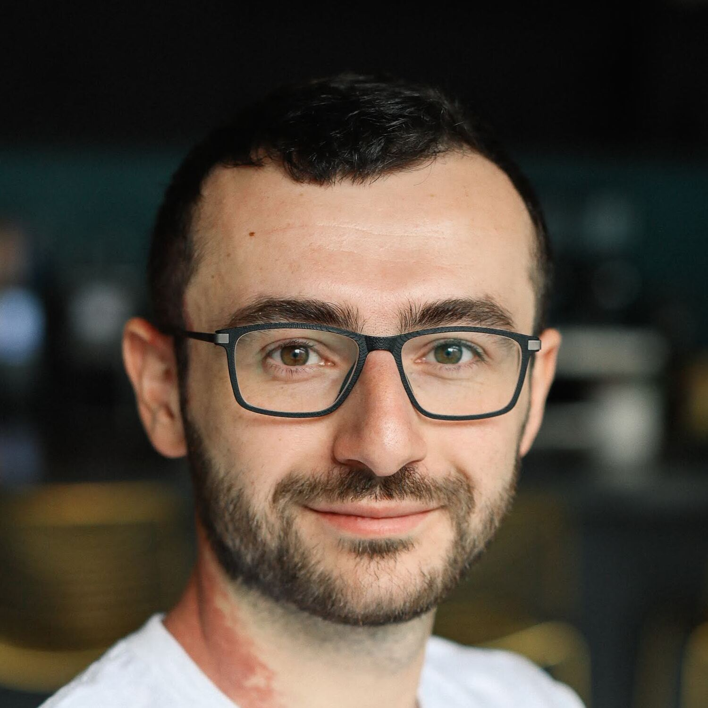

##  About Me

I am a CS **Ph.D. student** at [EPFL](https://epfl.ch) advised by prof.[Antoine Bosselut](https://atcbosselut.github.io/) at the [NLP lab](https://nlp.epfl.ch) and a Visiting Researcher at the [Università della Svizzera italiana](https://usi-nlp.github.io) supervised by prof.[Lonneke van der Plas](https://sites.google.com/site/lonnekenlp/). Currently, I am working as a **Student Researcher** in the Discovery team at Google DeepMind (London).

Previously, I completed my MSc. in Data Science at EPFL where I did research on commonsense and causal reasoning. In the past, I have been a software/ML engineer, co-founder/entrepreneur and have 5+ years of experience in areas ranging from semiconductors to AI. I am also a proud University of Waterloo alumnus where I finished my Bachelor's in Computer Science with distinction.

--- 

##  Research Interests

My interests broadly lie within the nature of **robust artificial intelligence, language, creativity and mind**. Currently, my research focuses on understanding, evaluating and improving creativity of AI systems. I am particularly interested in exploring **transformational (inventive) creativity** in current AI architectures for **scientific discoveries**. Additionally, I am interested in investigating core abilities essential for creativity in AI, including reasoning, generalization, compositionality, abstraction, and analogy-making. 

--- 

##  News

  
Jul 2026Two papers accepted at COLM 2026: <a href="https://arxiv.org/abs/2604.03374">CresOWLve</a> and <a href="https://arxiv.org/abs/2604.03480">Brain-LLM creativity alignment</a>.

  
Jul 2026Joined the Discovery team at Google DeepMind in London, UK as a <strong>Student Researcher</strong>.

  
May 2026<a href="https://arxiv.org/abs/2604.03374">CresOWLve</a> accepted at the ICML Human-AI Co-Creativity Workshop 2026.

  
Apr 2026Started a <strong>Research Internship</strong> at Microsoft Research, Cambridge, UK, working with Ryota Tomioka on LLMs for scientific discovery.

  
Apr 2026<a href="https://arxiv.org/abs/2509.14233">Apertus</a> accepted at ACL 2026.

  
Mar 2026Two preprints out: <a href="https://arxiv.org/abs/2604.03480">Large Language Models Align with the Human Brain during Creative Thinking</a> and <a href="https://arxiv.org/abs/2604.03374">CresOWLve: Benchmarking Creative Problem-Solving Over Real-World Knowledge</a>.

  
Mar 2026Received the <strong>Outstanding Reviewer</strong> award at IJCNLP AACL.

  
Oct 2025Awarded the <strong>Swiss AI Initiative PhD Fellowship</strong> for contributions to the development of Apertus models.

  
Aug 2025<a href="https://aclanthology.org/2025.findings-emnlp.509/">Creative Preference Optimization (CrPO)</a> accepted at EMNLP 2025 (Findings).

  
May 2025<a href="https://arxiv.org/abs/2411.02316">Evaluating Creative Short Story Generation in Humans and LLMs</a> accepted at ICCC 2025 (also presented at SfNC 2025).

  
Apr 2025<a href="https://aclanthology.org/2025.naacl-long.59/">Evaluating Morphological Compositional Generalization in LLMs</a> accepted at NAACL 2025.

  
Mar 2025Started as a <strong>Visiting Research Student</strong> at Università della Svizzera italiana, supervised by prof. Lonneke van der Plas.

  
Nov 2024<a href="https://www.pnas.org/doi/10.1073/pnas.2414955121">Could ChatGPT get an Engineering Degree?</a> published in PNAS 2024.

  
Oct 2024Preprint out: <a href="https://arxiv.org/abs/2410.17218">Creativity in AI: Progresses and Challenges</a>.

  
Aug 2024<a href="https://aclanthology.org/2024.acl-long.264/">DiffuCOMET</a> accepted at ACL 2024.

  
Aug 2024<a href="https://aclanthology.org/2024.findings-acl.384/">Exploring Defeasibility in Causal Reasoning</a> accepted at ACL 2024 (Findings).

  
Mar 2024<a href="https://aclanthology.org/2024.eacl-long.67/">REFINER</a> accepted at EACL 2024.

  
Dec 2023<a href="https://aclanthology.org/2023.emnlp-main.607">CRoW</a> accepted at AAAI NucLeaR Workshop 2024.

  
Oct 2023<a href="https://aclanthology.org/2023.emnlp-main.607">CRoW: Benchmarking Commonsense Reasoning in Real-World Tasks</a> accepted at EMNLP 2023 as an Oral presentation.

  
Sep 2023Started as a <strong>Research Assistant</strong> at Idiap Research Institute, Martigny, Switzerland.

  
Sep 2023Started <strong>Ph.D. in Computer Science</strong> at EPFL, advised by prof. Lonneke van der Plas (Idiap) and prof. Antoine Bosselut (EPFL).

  
May 2023<a href="https://aclanthology.org/2023.eacl-demo.12">kogito</a> accepted at EACL 2023 System Demonstrations Track.

  
Jul 2022Started a <strong>Research Internship</strong> at Sony Inc., Tokyo, Japan.

  
Sep 2021Started <strong>MSc in Data Science</strong> at EPFL, Lausanne, Switzerland.

--- 

##  Preprints

1. **Creativity in AI: Progresses and Challenges** 
    **Mete Ismayilzada**, Debjit Paul, Antoine Bosselut, Lonneke van der Plas 
    2024 
    [[paper](https://arxiv.org/abs/2410.17218)] [[code](https://github.com/mismayil/creativity-in-AI)] [[media](https://buildingcreativemachines.substack.com/p/unveiling-the-creativity-potential)]

##  Publications
1. **Large Language Models Align with the Human Brain during Creative Thinking** 
    **Mete Ismayilzada**, Simone A. Luchini, Abdulkadir Gokce, Badr AlKhamissi, Antoine Bosselut, Antonio Laverghetta Jr., Lonneke van der Plas\*, Roger E. Beaty\* 
    COLM 2026 
    [[paper](https://arxiv.org/abs/2604.03480)] [[code](https://github.com/mismayil/llm-brain-creative-alignment)]

1. **CresOWLve: Benchmarking Creative Problem-Solving Over Real-World Knowledge** 
    **Mete Ismayilzada**, Renqing Cuomao\*, Daniil Yurshevich\*, Anna Sotnikova, Lonneke van der Plas, Antoine Bosselut 
    COLM 2026 and ICML Human-AI Co-Creativity Workshop 2026 
    [[project](https://www.mete.is/cresowlve/)] [[paper](https://arxiv.org/abs/2604.03374)] [[benchmark](https://huggingface.co/datasets/mismayil/cresowlve)]

1. **Apertus: Democratizing Open and Compliant LLMs for Global Language Environments** 
    Apertus Team (*core contributor, Post-training & Evaluations) 
    ACL 2026 
    [[paper](https://arxiv.org/abs/2509.14233)] [[code](https://github.com/swiss-ai)] [[models & data](https://huggingface.co/swiss-ai)]

1. **Creative Preference Optimization** 
    **Mete Ismayilzada**, Antonio Laverghetta Jr., Simone A. Luchini, Reet Patel, Antoine Bosselut, Lonneke van der Plas\*, Roger E. Beaty\* 
    EMNLP 2025 (Findings) 
    [[project](https://www.mete.is/creative-preference-optimization/)] [[paper](https://aclanthology.org/2025.findings-emnlp.509/)] [[code](https://github.com/mismayil/creative-preference-optimization)] [[models & data](https://huggingface.co/collections/CNCL-Penn-State/crpo-67d0b11ff358430823dbb3df)]

1. **Evaluating Creative Short Story Generation in Humans and Large Language Models** 
    **Mete Ismayilzada**, Claire Stevenson, Lonneke van der Plas 
    ICCC 2025 (also presented at SfNC 2025) 
    [[paper](https://arxiv.org/abs/2411.02316)] [[dataset](https://huggingface.co/datasets/mismayil/creative_story_generation_dataset)] [[code](https://github.com/mismayil/creative-story-gen)]

1. **Evaluating Morphological Compositional Generalization in Large Language Models** 
    **Mete Ismayilzada**, Defne Circi\*, Jonne Sälevä\*, Hale Sirin, Abdullatif Köksal, Bhuwan Dhingra, Antoine Bosselut, Duygu Ataman, Lonneke van der Plas 
    NAACL 2025 
    [[paper](https://aclanthology.org/2025.naacl-long.59/)] [[code](https://github.com/mismayil/morph-gen)]

1. **CRoW: Benchmarking Commonsense Reasoning in Real-World Tasks** 
    **Mete Ismayilzada**, Debjit Paul\*, Syrielle Montariol\*, Mor Geva, Antoine Bosselut 
    EMNLP 2023 (Oral, also presented at AAAI NucLeaR Workshop 2024) 
    [[paper](https://aclanthology.org/2023.emnlp-main.607)] [[website](https://mete.is/crow)] 

1. **kogito: A Commonsense Knowledge Inference Toolkit.** 
    **Mete Ismayilzada**, Antoine Bosselut. 
    EACL System Demonstrations Track, 2023 
    [[paper](https://aclanthology.org/2023.eacl-demo.12)] [[code](https://github.com/epfl-nlp/kogito)] [[docs](https://kogito.readthedocs.io)]

1. **DiffuCOMET: Contextual Commonsense Knowledge Diffusion** 
    Silin Gao, **Mete Ismayilzada**, Mengjie Zhao, Hiromi Wakaki, Yuki Mitsufuji, Antoine Bosselut 
    ACL 2024 
    [[paper](https://aclanthology.org/2024.acl-long.264/)]

1. **Exploring Defeasibility in Causal Reasoning** 
    Shaobo Cui, Lazar Milikic, Yiyang Feng, **Mete Ismayilzada**, Debjit Paul, Antoine Bosselut, Boi Faltings 
    ACL 2024 (Findings) 
    [[paper](https://aclanthology.org/2024.findings-acl.384/)]

1. **REFINER: Reasoning Feedback on Intermediate Representations** 
    Debjit Paul, **Mete Ismayilzada**, Maxime Peyrard, Beatriz Borges, Antoine Bosselut, Robert West, Boi Faltings 
    EACL 2024 
    [[paper](https://aclanthology.org/2024.eacl-long.67/)]

1. **Could ChatGPT get an Engineering Degree? Evaluating Higher Education Vulnerability to AI Assistants** 
    Beatriz Borges, Negar Foroutan, Deniz Bayazit, Syrielle Montariol, Mohammadreza Banaei, [...], **Mete Ismayilzada**, Debjit Paul, Tanja Käser, Antoine Bosselut 
    PNAS 2024 
    [[paper](https://www.pnas.org/doi/10.1073/pnas.2414955121)]

---

##  Education

1. **Ph.D in Computer Science**. EPFL. Lausanne, Switzerland. 2023-Present.
1. **Master's in Data Science**. EPFL. Lausanne, Switzerland. 2021-2023.
1. **Bachelor's in Computer Science**. University of Waterloo. Waterloo, Canada. 2012-2016.

--- 

##  Research Experience

1. **Student Researcher**. Google DeepMind. London, UK. Jul 2026 - Present.
1. **Research Intern**. Microsoft Research. Cambridge, UK. Apr 2026 - Jun 2026.
1. **Visiting Research Student**. Università della Svizzera italiana. Lugano, Switzerland. Mar 2025 - Present.
1. **Research Assistant**. Idiap Research Institute. Martigny, Switzerland. Sep 2023 - Feb 2025.
1. **Research Assistant**. [Artificial Intelligence Lab](https://lia.epfl.ch/). EPFL. Fall 2022.
1. **Research Intern**. Sony Inc. Tokyo, Japan. Jul - Sep 2022.

---

##  Teaching Experience

1. **Teaching Assistant**. [Applied Data Analysis](https://dlab.epfl.ch/teaching/fall2025/cs401/). EPFL. Fall 2022, 2025.
1. **Teaching Assistant**. [Distributed Information Systems](https://edu.epfl.ch/coursebook/en/distributed-information-systems-CS-423). EPFL. Fall 2024.
1. **Teaching Assistant**. [Modern NLP](https://nlp.epfl.ch/cs-552-modern-nlp/). EPFL. Spring 2023, 2024, 2025.

---

##  Engineering Experience

1. **Software/ML Engineer**. integrate.ai. Toronto, Canada. Jun 2019 - Aug 2021.
1. **Co-founder/CTO**. Destin AI. Toronto, Canada. Sep 2017 - May 2019.
1. **Software Engineer**. Bluecat Networks. Toronto, Canada. Sep 2017 - Jun 2018.
1. **Software Engineer**. Cisco Systems. Ottawa, Canada. Jun 2016 - Aug 2017.
1. **Software Engineer Intern**. Freescale Semiconductors. Ottawa, Canada. Summer 2015.
1. **Software Developer Intern**. TD Securities. Toronto, Canada. Summer 2014.
1. **Software Developer Intern**. Azercell MMC. Baku, Azerbaijan. Summer 2013.

---

##  Service

1. **Reviewer**. COLM (2026), ICML Human-AI Co-creativity Workshop (2026), ACL ARR, SEM (Apr 2024), EACL (SRW Jan 2024, 2026), Journal of Creative Behaviour (Feb 2026).
1. **Volunteer**. Perspectives on AI Symposiums. IDIAP. Feb 2024.

---

##  Awards
1. **Outstanding Reviewer**. IJCNLP AACL. Mar 2026.
1. **Swiss AI Initiative PhD Fellowship**. Awarded for contributions to the development of Apertus models. Swiss AI Initiative. 2025.
1. **Undergraduate Scholarship**. Full funding for undergraduate studies at the University of Waterloo. Government of Azerbaijan. 2012-2016.
1. **Certificate of Distinction**. Euclid Mathematics Contest. University of Waterloo. 2012.
1. **Presidential Scholarship**. Awarded to top students entering university studies. Government of Azerbaijan. 2010.

---

##  Projects
1. **Parrot**. Educational toolkit for interaction with OpenAI models. [[code](https://github.com/epfl-nlp/parrot)]
1. **kogito**. A Python Commonsense Knowledge Inference Toolkit. [[docs](https://kogito.readthedocs.io/en/latest/)] [[code](https://github.com/epfl-nlp/kogito)]
1. **mini-pytorch**. From scratch implementation of (mini) pytorch autograd and several core modules. [[code](https://github.com/mismayil/mini-pytorch)]
1. **Words and Personalities**. Personality analysis based on quotes. [[demo](https://mismayil.github.io/words-personalities)] [[code](https://github.com/mismayil/words-personalities)]
1. **Differentially Private Random Forest Classifier**. [[code](https://github.com/IBM/differential-privacy-library/releases/tag/0.5.0)]

---

##  Misc
1. Interview for Swiss Info about Apertus. SwissInfo. [[link](https://www.swissinfo.ch/eng/swiss-ai/fact-and-fiction-about-the-swiss-ai-model-apertus/90110034)]
1. Interview for Building Creative Machines. Substack. [[link](https://buildingcreativemachines.substack.com/p/interview-mete-ismayilzada-unlocking)]
1. From Words to Vectors. Towards Data Science. Medium. [[link](https://medium.com/towards-data-science/from-words-to-vectors-e24f0977193e)]

---

##  Hobbies
In my free time, I like to [read](https://www.goodreads.com/user/show/34889251-mete-ismayil), [road bike](https://www.strava.com/athletes/33241990), [play piano and dombra](https://youtube.com/playlist?list=PLWgqALhmmentLA30W40VUV6HXOHH0n6z-) and watch (usually long) [international art films](https://boxd.it/ggyee).

---

##  Contact
1. [mismayilza [at] gmail [dot] com](mailto:)
1. [google scholar](https://scholar.google.com/citations?hl=en&user=l88cHEQAAAAJ)
1. [github](https://github.com/mismayil)
1. [linkedin](https://www.linkedin.com/in/mismayilzada)
